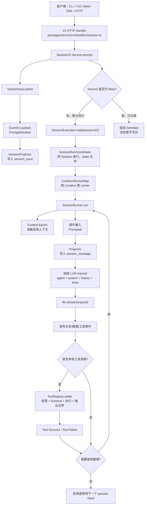
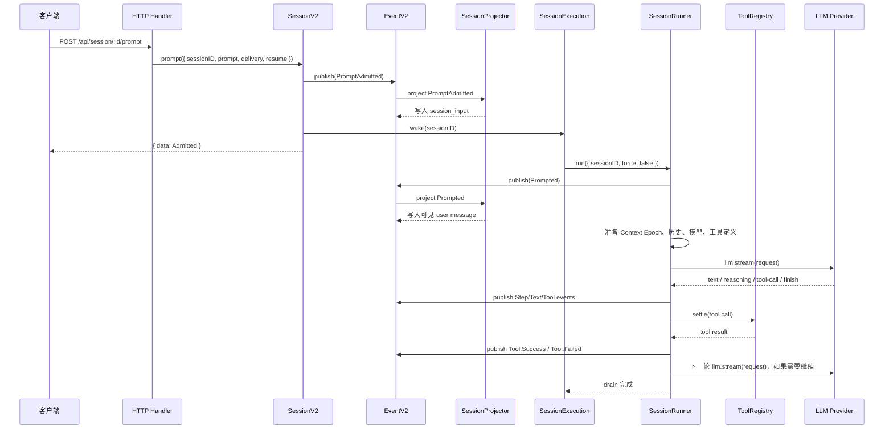

# TeleCode 技术知识文档：V2 会话核心与 Agent 执行链路

## 简短介绍

TeleCode 是一个开源 AI 编程代理项目。用户通过 CLI、TUI、桌面应用、Web 或 HTTP/SDK 发送需求，系统会把需求放入一个会话，然后选择 Agent、模型、工具和权限策略，驱动大模型完成代码阅读、修改、命令执行、提问、总结、回滚等工作。

当前仓库是一个 Bun/Turbo 管理的多包项目，并且处于 V1 和 V2 会话体系共存迁移阶段：

- 旧实例 API 和部分运行时仍在 `packages/telecode/src/session`、`packages/telecode/src/server/routes/instance/httpapi` 中。
- 新 V2 核心主要在 `packages/core/src/session`、`packages/server/src/handlers`、`packages/protocol/src/groups`、`packages/schema/src` 中。
- 本文重点解释 V2 Session Core，因为它体现了当前项目最重要的核心设计：耐久输入、事件投影、Location 级运行时、模型流式执行和工具结算。

## 项目结构速览

| 路径 | 作用 |
| --- | --- |
| `packages/telecode` | CLI 入口、旧运行时、TUI/实例服务集成、兼容路由 |
| `packages/core` | 核心领域逻辑：Session、Event、Tool、Permission、Config、Location、Catalog、Provider、System Context |
| `packages/protocol` | V2 HTTP API 定义，基于 Effect `HttpApi` 描述路由、参数、响应、错误 |
| `packages/server` | V2 HTTP API handler，将协议层请求映射到 `@telecode-ai/core` 服务 |
| `packages/schema` | 跨包共享的 Schema、ID、请求响应数据结构 |
| `packages/llm` | 统一模型请求、响应事件、Provider route、工具事件抽象 |
| `packages/sdk/js` | 生成的 JavaScript SDK 与服务启动辅助 |
| `packages/sdk-next` | Effect-native 的进程内 SDK，复用 HTTP router 但不打开网络端口 |
| `packages/tui`、`packages/app`、`packages/desktop`、`packages/web` | 终端 UI、Web/桌面应用、官网文档等用户界面 |

## 关键术语表

| 术语 | 通俗解释 | 代码位置 |
| --- | --- | --- |
| Session | 一段 AI 编程对话和它的所有上下文、消息、工具结果、成本、回滚状态 | `packages/core/src/session.ts` |
| Session ID | 会话的唯一 ID，执行层只拿它来找到会话和 Location | `packages/schema/src/session-id.ts` |
| Location | 会话所在的工作目录和可选 workspace，决定文件系统、配置、工具、模型目录等运行环境 | `packages/core/src/location.ts` |
| LocationServiceMap | 按 Location 缓存一整套服务，60 分钟空闲后释放 | `packages/core/src/location-layer.ts` |
| Prompt | 用户输入，包含文本、文件附件、Agent 附件 | `packages/schema/src/prompt.ts` |
| session_input | V2 的耐久输入收件箱。Prompt 先进入这里，不会立刻变成模型可见历史 | `packages/core/src/session/input.ts` |
| Delivery | 输入投递模式：`steer` 表示尽快转向，`queue` 表示等当前任务空闲后排队执行 | `packages/schema/src/session-delivery.ts` |
| EventV2 | 事件总线和耐久事件存储。会话变化先写事件，再投影到查询表 | `packages/core/src/event.ts` |
| Durable Event | 可重放的事件，带 aggregate sequence，用于恢复、同步、分页和投影 | `packages/core/src/event.ts` |
| Projector | 事件投影器，把事件更新为 `session`、`session_message`、`session_input` 等查询表 | `packages/core/src/session/projector.ts` |
| SessionMessage | 投影后的会话消息，包含 user、assistant、tool、system、compaction 等类型 | `packages/core/src/session/message.ts` |
| SessionRunner | V2 agent loop 的执行器：组装请求、调用模型、执行工具、判断是否继续 | `packages/core/src/session/runner/llm.ts` |
| Context Epoch | 当前会话的系统上下文基线和快照，保证模型看到的环境事实可追踪、可比较 | `packages/core/src/session/context-epoch.ts` |
| System Context | 环境、日期、AGENTS 指令、技能指导等模型前置上下文来源的组合 | `packages/core/src/system-context` |
| Agent | 运行人格和能力配置，包含 system prompt、权限、步骤上限、模型偏好 | `packages/core/src/agent.ts` |
| Model Catalog | 当前 Location 可用 provider/model 的目录，来自内置、配置、账号、插件等 | `packages/core/src/catalog.ts` |
| Tool | 模型可调用的本地能力，有输入 Schema、输出 Schema 和执行函数 | `packages/core/src/tool/tool.ts` |
| ToolRegistry | Location 级工具注册表，负责工具定义物化、输入输出校验、陈旧调用拒绝、结果裁剪 | `packages/core/src/tool/registry.ts` |
| PermissionV2 | 工具权限系统，按 Agent 规则、用户保存的审批、待审批请求决定 allow/ask/deny | `packages/core/src/permission.ts` |
| Compaction | 对长会话做摘要检查点，减少模型上下文压力，但保留完整耐久历史 | `packages/core/src/session/compaction.ts` |
| Snapshot | 文件快照，用于 step 前后 diff、undo/revert | `packages/core/src/snapshot.ts` |

## 一句话理解核心逻辑

TeleCode 的核心不是普通聊天接口，而是一个“可恢复的编程代理循环”：

1. 用户输入先被写成耐久记录。
2. 执行器在安全边界把输入提升为模型可见消息。
3. 系统组装环境上下文、历史、工具定义、模型配置。
4. 大模型流式返回文本、推理和工具调用。
5. 本地工具在权限控制下执行，并把结果写回会话历史。
6. 如果工具结果需要继续推理，就再发起下一次 provider turn。
7. 所有关键状态都通过事件和投影表保存，方便重放、分页、恢复和 UI 展示。

## 输入与输出

### 输入是什么

TeleCode 的输入不只是用户一句话，完整输入包括：

| 输入来源 | 内容 |
| --- | --- |
| 用户 Prompt | 文本、文件附件、Agent 附件 |
| Session 参数 | `sessionID`、可选 `messageID`、`delivery`、`resume` |
| Location | 工作目录、workspace、项目根、Git 状态 |
| 配置 | `telecode.json`、`.telecode`、全局配置、Provider、Agent、工具输出限制、compaction 等 |
| 系统上下文 | 环境信息、日期、AGENTS/指令、技能指导、引用指导 |
| 模型目录 | Provider、Model、Credential、Variant |
| 工具目录 | 内置工具、应用工具、未来插件工具 |
| 权限规则 | Agent permissions、保存过的审批、用户实时回复 |
| 历史状态 | 已投影消息、未提升输入、compaction checkpoint、Context Epoch |

### 输出是什么

TeleCode 的输出分多层：

| 输出层 | 内容 |
| --- | --- |
| API 立即响应 | 创建会话结果、Prompt admission 结果、分页消息、错误结构 |
| 耐久事件 | `PromptAdmitted`、`Prompted`、`Step.Started`、`Text.Ended`、`Tool.Success`、`Step.Ended` 等 |
| 投影消息 | UI/SDK 查询到的 user/assistant/tool/system/compaction 消息 |
| 模型可见历史 | 送入 provider 的 system + user + assistant + tool 消息 |
| 文件副作用 | 工具可能修改文件，Step 结束时通过 snapshot 记录 diff |
| 工具结果 | 结构化输出、文本/文件内容、过大输出的托管引用 |
| 会话统计 | tokens、cost、更新时间、回滚状态 |

## 核心执行流程

下面用通俗步骤描述一次 V2 Prompt 从 API 进入到模型执行完成的过程。

1. 客户端调用 `POST /api/session/:sessionID/prompt`，传入 `prompt`、可选 `id`、`delivery`、`resume`。
2. `packages/server/src/handlers/session.ts` 将 HTTP 请求交给 `SessionV2.Service.prompt(...)`。
3. `SessionV2.prompt` 先检查 Session 是否存在，再生成或使用调用方传入的 message ID。
4. `SessionInput.admit` 发布耐久事件 `session.next.prompt.admitted`。
5. `SessionProjector` 把该事件投影到 `session_input` 表，此时用户消息还没有进入 `session_message`。
6. 如果 `resume !== false`，`SessionExecution.wake(sessionID)` 会通知执行层有新工作。
7. `SessionRunCoordinator` 保证同一个 Session 同一时刻只有一个本地 drain；重复 wake 会合并，显式 resume 会加入当前执行。
8. `SessionExecution` 用 `SessionStore.get(sessionID)` 读会话，再通过 `LocationServiceMap.get(session.location)` 找到该 Location 的 runner。
9. `SessionRunner.run` 检查是否有待提升的 `steer` 或 `queue` 输入。
10. Runner 先清理上次进程遗留的 running/pending 本地工具，避免崩溃后静默重放副作用。
11. Runner 初始化或准备 `Context Epoch`，把环境事实、日期、指令、技能指导等组成模型系统上下文。
12. 在安全边界提升输入：`steer` 批量提升到 cutoff，`queue` 每次只提升一个，然后再合并新 `steer`。
13. 提升动作发布 `session.next.prompted`，投影器把它写入 `session_message`，这时用户消息才对模型可见。
14. Runner 解析 Agent、模型、历史消息、工具定义，组装一个 `LLM.request(...)`。
15. Runner 调用一次且只调用一次 `llm.stream(request)`，消费 provider 流事件。
16. `createLLMEventPublisher` 把文本、推理、工具输入、工具调用、provider 错误等转为会话事件。
17. 如果出现本地工具调用，Runner 先持久化工具调用，再通过 `ToolRegistry.Materialization.settle(...)` 执行工具。
18. 工具输入先按 Schema 解码，执行后按输出 Schema 编码，再经 `ToolOutputStore` 做模型输出边界控制。
19. 工具结果发布为 `Tool.Success` 或 `Tool.Failed`，并成为下一轮模型可见的 tool result。
20. 如果有本地工具结果且没有 provider 错误，Runner 重载投影历史，进入下一次 provider turn。
21. 如果没有继续条件，Runner 检查是否还有 `queue` 输入；有则提升一个继续跑，没有则会话变为空闲。

## 流程图



## 时序图



## API 示例

下面示例基于 V2 HTTP API。示例 ID 和时间是示意值，真实值由服务生成。

### 创建会话

请求：

```http
POST /api/session
Content-Type: application/json
x-telecode-directory: E%3A%5Cjava2026%5CTeleCode

{
  "agent": "build",
  "model": {
    "providerID": "openai",
    "id": "gpt-5"
  },
  "location": {
    "directory": "E:\\java2026\\TeleCode"
  }
}
```

响应：

```json
{
  "data": {
    "id": "ses_0123456789abcdef",
    "projectID": "proj_0123456789abcdef",
    "agent": "build",
    "model": {
      "providerID": "openai",
      "id": "gpt-5"
    },
    "cost": 0,
    "tokens": {
      "input": 0,
      "output": 0,
      "reasoning": 0,
      "cache": {
        "read": 0,
        "write": 0
      }
    },
    "time": {
      "created": 1782360000000,
      "updated": 1782360000000
    },
    "title": "New session - 2026-06-25T00:00:00.000Z",
    "location": {
      "directory": "E:\\java2026\\TeleCode"
    }
  }
}
```

### 发送 Prompt，但只入队不执行

请求：

```http
POST /api/session/ses_0123456789abcdef/prompt
Content-Type: application/json
x-telecode-directory: E%3A%5Cjava2026%5CTeleCode

{
  "id": "msg_http_prompt",
  "prompt": {
    "text": "请阅读当前项目并总结核心架构"
  },
  "delivery": "steer",
  "resume": false
}
```

响应：

```json
{
  "data": {
    "admittedSeq": 0,
    "id": "msg_http_prompt",
    "sessionID": "ses_0123456789abcdef",
    "prompt": {
      "text": "请阅读当前项目并总结核心架构"
    },
    "delivery": "steer",
    "timeCreated": 1782360001000
  }
}
```

注意：此时 `GET /api/session/:sessionID/message` 可能仍然返回空数组，因为 Prompt 只是进入了 `session_input`，还没有被提升成可见 user message。

### 发送 Prompt 并唤醒执行

请求：

```http
POST /api/session/ses_0123456789abcdef/prompt
Content-Type: application/json

{
  "prompt": {
    "text": "修复失败测试，并说明改动原因"
  },
  "delivery": "steer"
}
```

响应仍然是 admission，而不是最终 AI 答案：

```json
{
  "data": {
    "admittedSeq": 1,
    "id": "msg_0123456789abcdef",
    "sessionID": "ses_0123456789abcdef",
    "prompt": {
      "text": "修复失败测试，并说明改动原因"
    },
    "delivery": "steer",
    "timeCreated": 1782360002000
  }
}
```

后续可以通过消息查询或事件订阅读取结果。

### 查询会话消息

请求：

```http
GET /api/session/ses_0123456789abcdef/message?limit=20
```

响应：

```json
{
  "data": [
    {
      "id": "msg_0123456789abcdef",
      "type": "user",
      "time": {
        "created": 1782360002000
      },
      "text": "修复失败测试，并说明改动原因"
    },
    {
      "id": "msg_abcdef0123456789",
      "type": "assistant",
      "agent": "build",
      "model": {
        "providerID": "openai",
        "id": "gpt-5"
      },
      "time": {
        "created": 1782360003000,
        "completed": 1782360008000
      },
      "finish": "stop",
      "content": [
        {
          "type": "text",
          "id": "text_1",
          "text": "已完成修复，并通过相关检查。"
        }
      ]
    }
  ],
  "cursor": {
    "next": "eyJpZCI6Ii4uLiJ9"
  }
}
```

### 精确重试与冲突

相同 `id`、相同 `sessionID`、相同 `prompt`、相同 `delivery` 的请求是幂等的，会返回同一条 admission。

如果复用同一个 message ID 但改了 prompt，服务返回 409：

```json
{
  "_tag": "ConflictError",
  "message": "Prompt message ID conflicts with an existing durable record: msg_http_prompt",
  "resource": "msg_http_prompt"
}
```

### 缺失会话错误

```json
{
  "_tag": "SessionNotFoundError",
  "sessionID": "ses_missing",
  "message": "Session not found: ses_missing"
}
```

### 尚未实现的 V2 操作

当前 V2 `compact` 和 `wait` 在部分路径上已经定义了 API，但 core facade 仍可能返回 503：

```json
{
  "_tag": "ServiceUnavailableError",
  "message": "Session compact is not available yet",
  "service": "session.compact"
}
```

## 核心逻辑与设计意图

### 1. 为什么 Prompt 先进入 `session_input`

设计意图：把“接收用户输入”和“调用模型执行”拆开。

好处：

- API 能快速确认输入已经被可靠记录。
- `resume: false` 可以只入队，适合批处理、测试、外部调度。
- 进程崩溃或客户端断线后，已接收的输入仍在数据库里。
- `steer` 和 `queue` 可以表达不同交互意图。
- 精确重试可以做到幂等，不会重复插入用户消息。

通俗理解：用户输入先放进“挂号窗口”，runner 到安全时机再把它叫进诊室。

### 2. 为什么执行层只拿 Session ID

`SessionExecution.resume(sessionID)` 和 `wake(sessionID)` 不直接接收 Location、模型或工具。执行前会重新读取 Session，再根据 `session.location` 找 Location 级运行时。

设计意图：

- 防止调用方拿旧 Location 执行新会话。
- 为未来远程执行、多 workspace、分布式 placement 留接口。
- 保持 `SessionRunner`、工具、权限、文件系统都在 Location 作用域内。

### 3. 为什么用 EventV2 + Projector

会话里的关键变化都先变成事件，例如：

- `PromptAdmitted`
- `Prompted`
- `ContextUpdated`
- `Step.Started`
- `Text.Ended`
- `Tool.Called`
- `Tool.Success`
- `Step.Ended`
- `Revert.Staged`

投影器再把事件更新到适合查询的表。

设计意图：

- 事件是事实来源，投影表是查询缓存。
- 可以按 sequence 重放事件，恢复 `session_message` 等投影。
- API 分页和事件订阅可以共享同一个 durable cursor 语义。
- UI 可以收到实时事件，断线后再从 durable sequence 继续。

### 4. 为什么区分 Context Epoch 和普通消息

模型系统上下文包含工作目录、日期、项目指令、技能指导等“有权限的事实”。这些内容如果每次偷偷变化，模型历史会变得不可解释。

Context Epoch 的做法是：

1. 第一次执行前生成完整 baseline。
2. 保存一个结构化 snapshot。
3. 后续安全边界重新观察各个 Context Source。
4. 如果变了，就追加一个耐久 system message。
5. 如果 compaction 或 Session move 需要新基线，就重建 epoch。

设计意图：让模型看到的环境事实可解释、可重放、可比较。

### 5. 为什么工具执行要先“物化”

每个 provider turn 开始前，`ToolRegistry.materialize(...)` 会生成当轮可用工具定义，并捕获每个工具注册的身份。

如果模型稍后调用工具，但工具注册已经被关闭或替换，settlement 会返回 `Stale tool call`，不会执行新工具。

设计意图：

- 模型看到的工具和真正执行的工具必须是同一个版本。
- 防止工具热替换导致“模型以为调用 A，系统实际执行 B”。
- 支持 Location 工具覆盖应用工具，同时保持作用域清晰。

### 6. 为什么工具权限不放在 Registry 里

`ToolRegistry` 只负责注册、Schema、执行和结果边界。具体权限由工具自己调用 `PermissionV2.assert(...)`。

设计意图：

- 不同工具知道自己的资源边界，例如文件路径、命令、外部目录。
- 权限请求可以包含更准确的 metadata 和保存规则。
- Registry 不需要理解每个工具的业务含义。

### 7. 为什么每轮只显式调用一次 `llm.stream(request)`

Runner 的一个 provider turn 只组装一个 request，并调用一次 `llm.stream(request)`。如果工具结果需要继续推理，先持久化工具结果、重载历史，再开启下一轮。

设计意图：

- 每一轮模型请求边界清楚。
- 工具副作用不会被隐式重放。
- 失败、打断、context overflow 可以在明确边界处理。
- 后续 compaction、重试策略更容易证明安全。

## 设计模式

| 模式 | 项目中的体现 | 作用 |
| --- | --- | --- |
| 依赖注入 / Service Locator | Effect `Context.Service`、`Layer`、`LayerMap` | 按 Location 装配配置、工具、模型、文件系统、权限 |
| Event Sourcing | `EventV2.publish`、`events.project`、`event` 表 | 用事件作为事实来源，支持重放和同步 |
| CQRS 风格 | 事件写入与 `session_message`、`session_input` 查询表分离 | 写模型和读模型分离，便于分页和 UI 展示 |
| Registry | `ToolRegistry`、`SystemContextRegistry`、`Catalog` | 动态注册工具、上下文源、Provider/Model |
| Unit of Work | durable event 写入和投影在事务里完成 | 保证事件和投影一致 |
| Coordinator / Single Flight | `SessionRunCoordinator` | 同一 Session 串行执行，重复 wake 合并 |
| Strategy | Provider route、模型协议适配、工具实现 | 不同 Provider/工具可替换 |
| Scoped Resource | Effect `Scope` 注册工具、Location TTL、Layer finalizer | 工具和服务生命周期自动清理 |
| Facade | `SessionV2.Service` | 给外部提供简洁接口，隐藏事件、投影、执行细节 |
| Adapter | `SessionRunnerModel.fromCatalogModel`、HTTP handler、SDK client | 把外部协议或配置转换成内部统一模型 |

## 常见问题与避坑

### 为什么调用 prompt 后查不到消息？

因为 V2 prompt 默认先写 `session_input`。只有 runner 在安全边界发布 `Prompted` 后，投影器才会把它写进 `session_message`。如果请求传了 `resume: false`，它只会记录，不会自动执行。

### `prompt` API 的响应是不是 AI 回复？

不是。V2 `POST /api/session/:id/prompt` 返回的是 `SessionInput.Admitted`，表示输入已被耐久接收。AI 回复需要通过消息查询或事件订阅读取。

### 什么时候用 `steer`，什么时候用 `queue`？

- `steer`：用户想尽快改变当前方向。runner 会在下一个安全 provider-turn 边界批量提升 steer。
- `queue`：用户想把任务排到当前任务后面。runner 会在当前 drain 本来要空闲时，每次提升一个 queue。

### 为什么同一个 message ID 会冲突？

message ID 是全局唯一的幂等键。完全相同的 retry 会返回同一记录；只要 Session、Prompt 或 delivery 任一项不同，就会被视为冲突，避免重复或错配历史。

### 为什么 V2 `compact`、`wait` 有路由却可能 503？

协议层已经定义接口，但 core facade 中部分能力仍标记为未完成。调用方要按 `ServiceUnavailableError` 做兼容。

### 工具为什么会返回 `Stale tool call`？

模型看到工具定义后，工具注册如果被移除或替换，当轮物化的注册身份就失效。系统会拒绝执行，避免执行模型没有看到的新工具。

### V2 bash 是否是沙箱？

不是。规格明确说明 V2 `bash` 按普通权限语义运行，spawn 的 shell 具有宿主用户的文件系统、进程和网络权限。权限提示不是系统级沙箱边界。

### 权限规则的默认行为是什么？

`PermissionV2.evaluate` 没有匹配规则时默认 `ask`。但如果 Agent 缺失，系统使用全拒绝规则，避免没有 Agent 策略时意外给工具权限。

### 为什么有些流式 delta 不在数据库里？

文本、推理、工具输入 delta 可能作为实时事件广播，但 durable projection 主要保存完整片段结束事件。这样可以减少数据库重写和历史膨胀。断线重连依赖 durable ended/result 事件，而不是 ephemeral delta。

### 为什么 Provider 不可用时不一定重试？

当前 V2 runner 没有通用 provider 超时/重试策略。context overflow 在“尚未产生耐久 assistant 输出”时有一次 compaction recovery 机会；已经产生输出后不会自动重放，避免重复副作用。

### 为什么测试不能在仓库根目录跑？

根 `package.json` 的 `test` 明确是防误用脚本：`echo 'do not run tests from root' && exit 1`。应进入包目录运行，例如：

```bash
cd packages/telecode
bun test
```

类型检查也应在包目录运行：

```bash
cd packages/telecode
bun typecheck
```

### 修改 SDK 后要做什么？

仓库说明要求重新生成 JavaScript SDK 时运行：

```bash
./packages/sdk/js/script/build.ts
```

## 新人阅读代码建议

建议按下面顺序读：

1. `README.md`：了解 TeleCode 是什么。
2. `package.json`：看 workspace、脚本、依赖。
3. `packages/telecode/src/index.ts`：看 CLI 如何分发命令。
4. `packages/protocol/src/api.ts` 和 `packages/protocol/src/groups/session.ts`：看 V2 API 形状。
5. `packages/server/src/handlers/session.ts`：看 API 如何映射到 core service。
6. `packages/core/src/session.ts`：看 Session facade。
7. `packages/core/src/session/input.ts`：看 admission、promotion、delivery。
8. `packages/core/src/session/execution/local.ts` 和 `run-coordinator.ts`：看执行调度。
9. `packages/core/src/session/runner/llm.ts`：看 agent loop 主体。
10. `packages/core/src/session/projector.ts`：看事件如何变成消息。
11. `packages/core/src/tool/tool.ts` 和 `tool/registry.ts`：看工具模型。
12. `packages/core/src/system-context`：看系统上下文为什么可持久化。
13. `packages/core/test/session-prompt.test.ts`、`session-runner.test.ts`、`session-runner-tool-registry.test.ts`：用测试理解边界行为。

## 核心代码索引

| 主题 | 文件 |
| --- | --- |
| CLI 入口 | `packages/telecode/src/index.ts` |
| V2 协议聚合 | `packages/protocol/src/api.ts` |
| V2 Session API 定义 | `packages/protocol/src/groups/session.ts` |
| V2 Session handler | `packages/server/src/handlers/session.ts` |
| Session facade | `packages/core/src/session.ts` |
| Prompt admission/promotion | `packages/core/src/session/input.ts` |
| Session 执行入口 | `packages/core/src/session/execution.ts` |
| 本地执行路由 | `packages/core/src/session/execution/local.ts` |
| 同会话串行协调器 | `packages/core/src/session/run-coordinator.ts` |
| Runner 主循环 | `packages/core/src/session/runner/llm.ts` |
| 模型解析 | `packages/core/src/session/runner/model.ts` |
| LLM 事件发布 | `packages/core/src/session/runner/publish-llm-event.ts` |
| LLM 历史转换 | `packages/core/src/session/runner/to-llm-message.ts` |
| 投影器 | `packages/core/src/session/projector.ts` |
| 会话表结构 | `packages/core/src/session/sql.ts` |
| 事件总线和耐久事件 | `packages/core/src/event.ts` |
| Location 装配 | `packages/core/src/location-layer.ts` |
| 系统上下文 | `packages/core/src/system-context/index.ts` |
| Context Epoch | `packages/core/src/session/context-epoch.ts` |
| 工具定义 | `packages/core/src/tool/tool.ts` |
| 工具注册表 | `packages/core/src/tool/registry.ts` |
| 权限系统 | `packages/core/src/permission.ts` |
| 配置加载 | `packages/core/src/config.ts` |
| V2 设计说明 | `specs/v2/session.md`、`specs/v2/tools.md`、`specs/v2/config.md` |

## 总结

TeleCode 的核心设计目标是：让 AI 编程代理的每一步都能被可靠记录、明确恢复、按 Location 隔离，并且在模型、工具、权限、系统上下文不断变化时仍保持可解释。

最重要的三条主线是：

1. **输入耐久化**：Prompt 先入 `session_input`，再在安全边界提升为可见历史。
2. **执行可恢复**：Session 变化通过 durable events 记录，再投影成查询表。
3. **能力可控**：模型、工具、权限、系统上下文都按 Location 和 Agent 作用域装配，不把全局状态直接塞进 runner。

如果只记一句话：TeleCode V2 把“AI 回复”拆成了一套可持久化、可重放、可权限控制的 Agent 工作流，而不是一次简单的聊天请求。
